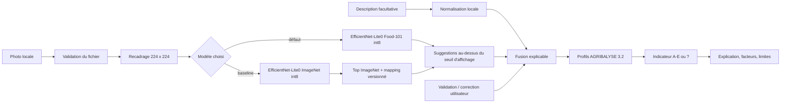
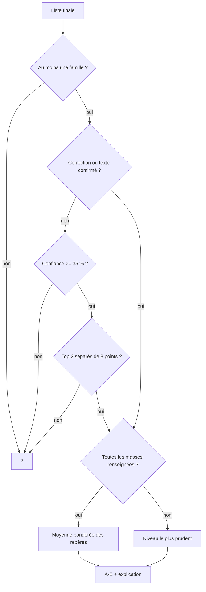

# Architecture — EcoPlate Edge

## À retenir

EcoPlate Edge est un site statique : le navigateur charge le modèle et exécute
l’inférence localement. L’image et le texte ne transitent jamais par un backend.
La vision, la fusion des signaux et le calcul climatique sont séparés afin de
limiter les couplages et de rendre chaque décision testable.

## Vue fonctionnelle

## Frontières de confidentialité

Le navigateur télécharge des fichiers statiques publics : HTML, CSS, JavaScript,
WebAssembly, modèle TFLite, profils JSON et documentation publique. Une fois ces ressources
chargées, les données de l’utilisateur restent dans les objets mémoire de la page.

Il n’existe aucun composant pour :

- envoyer l’image ou le texte avec `fetch` ;
- créer un compte ou un identifiant ;
- écrire une prédiction dans un stockage distant ;
- appeler une API d’inférence ;
- enregistrer automatiquement l’image dans `localStorage` ou IndexedDB.

## Responsabilités des modules

| Module | Entrée | Sortie | Responsabilité |
|---|---|---|---|
| `vision/preprocess.ts` | `File` local | canvas 224 × 224 | Validation, décodage, recadrage central |
| `vision/modelConfig.ts` | identifiant modèle | nom, taille, SHA-256, labels | Identité vérifiable des deux artefacts |
| `vision/model.ts` | canvas + modèle | classes, scores, latence | Chargement à la demande, inférence et agrégation des vues |
| `vision/classMapping.ts` | classe directe ou ImageNet | famille éventuelle | Passage direct des 8 sorties et mapping du baseline |
| `evaluation/metrics.ts` | prédictions + vérités | accuracy, top-3, macro-F1, matrice, seuils | Mesures testées sans dépendre de l'UI |
| `text/normalizeIngredients.ts` | texte | familles, grammes, inconnus | Règles déterministes, accents et synonymes |
| `fusion/mergeCandidates.ts` | vision, texte, utilisateur | liste finale, contradictions | Déduplication et ordre de priorité |
| `climate/calculateScore.ts` | liste finale | A–E / `?`, facteurs, limites | Décision métier testable |
| `ui/*` | état typé | DOM | Interaction, accessibilité et présentation |

## Règles de décision

## Déploiement statique

Le build Vite produit des chemins relatifs (`base: './'`). Le modèle et les trois
variantes du runtime WebAssembly sont copiés tels quels dans `dist`. GitHub Actions
exécute les tests avant de publier l'artefact Pages. L'échec d'un test ou du build
interrompt le déploiement.

Le code SlimSAM est chargé dynamiquement uniquement pour l'ablation. Ses poids
devraient être téléchargés par Transformers.js ; l'image resterait locale. Le
benchmark autonome a échoué avant toute inférence avec une erreur réseau. L'option
est donc désactivée dans l'interface tant que les poids ne sont pas distribués
localement. L'image entière reste le prétraitement par défaut.
