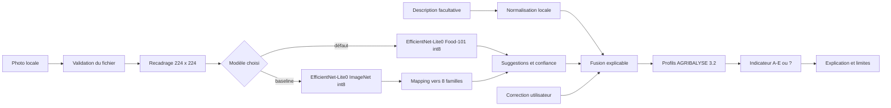
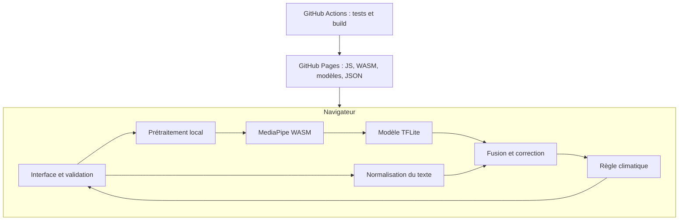

# Rapport de conduite de projet AI Engineering — EcoPlate Edge

## Du besoin au prototype local et explicable

**Version :** 2.0 — 29 septembre 2026  
**Nature :** projet personnel technique réalisé dans le cadre de la formation  
**Périmètre :** preuve de concept (POC) web, sans backend  
**Statut :** MVP fonctionnel, benchmark Food-101 et documentation réalisés ; validation sur 30 photographies en conditions réelles et audit d’accessibilité restant à mener

## Synthèse exécutive

EcoPlate Edge répond à la question suivante : peut-on donner un premier repère
climatique à partir d’une photo sans envoyer cette photo à un serveur ? Le POC
utilise un modèle EfficientNet-Lite0 quantifié, exécuté dans le navigateur avec
MediaPipe. L’utilisateur voit les propositions du modèle, peut les corriger et peut
ajouter une description. Une règle séparée relie ensuite huit familles alimentaires
à des profils AGRIBALYSE 3.2 pour afficher un niveau A–E, ou `?` lorsque le signal
est trop incertain.

Le modèle spécialisé sur Food-101 atteint 54,27 % en top-1, 82,95 % en top-3 et
53,69 % en macro-F1 sur les 25 250 images du jeu de validation relabellisé, contre
15,28 %, 33,90 % et 17,02 % pour la référence ImageNet. Il pèse 3,95 Mio. Ces
résultats justifient son choix pour le POC, mais ne démontrent pas son efficacité sur
des photos prises par de vrais utilisateurs. La correction humaine, le texte et le
rejet restent donc nécessaires.

La solution retenue est un site statique déployable sur GitHub Pages. Elle ne demande
aucun service payant et réduit la surface d’attaque. Le principal risque résiduel est
la généralisation hors de Food-101. La prochaine décision de produit dépend donc
d’une campagne déjà préparée de 30 photos sur ordinateur et mobile.

# 1. Contexte et analyse des besoins

## 1.1 Présentation de l’organisation et du contexte

EcoPlate Edge est un projet personnel réalisé pour la formation. Il ne répond pas à
la commande d’un client réel et ne remplace aucun système existant. Le rôle de
porteur du projet regroupe donc le cadrage, l’audit des données, les choix techniques,
le développement, l’évaluation, la documentation et le déploiement. Le mentor valide
le sujet, la carte mentale et le support du portfolio ; l’évaluateur apprécie les
livrables et les compétences démontrées.

Le projet se situe dans le secteur de l’information environnementale appliquée à
l’alimentation. Sa valeur n’est pas de produire une empreinte carbone exacte, ce
qu’une photo seule ne permet pas, mais de démontrer une chaîne IA locale, explicable
et corrigible.

### Enjeux du projet

- démontrer un cas d’usage IA compréhensible en moins d’une minute ;
- protéger une image potentiellement personnelle ;
- éviter qu’un indicateur pédagogique soit pris pour une mesure scientifique ;
- construire un prototype réellement exécutable et pas seulement une maquette ;
- fournir des preuves consultables : code, modèle, tests, mesures et documentation ;
- rester compatible avec un hébergement statique gratuit.

### Maturité initiale et cible

| Domaine | Situation initiale | Cible du POC | État atteint |
|---|---|---|---|
| Produit | idée de démonstration | parcours utilisable | MVP déployable |
| Données | aucune donnée projet préparée | sources versionnées et auditées | Food-101 et profils AGRIBALYSE documentés |
| Modèle | aucune référence intégrée | baseline puis modèle spécialisé | deux modèles comparés, artefacts vérifiés |
| MLOps | aucun pipeline | contrôle automatisé minimal | tests, build et déploiement GitHub Actions |
| Monitoring | aucune observation | mesures locales et protocole exportable | latence affichée ; télémétrie distante exclue |
| Validation terrain | aucune photo utilisateur | 30 photos autorisées sur ordinateur et mobile | protocole prêt, collecte non réalisée |

La maturité visée reste celle d’un POC. Le projet ne couvre ni exploitation en
production, ni registre de modèles, ni réentraînement automatique, ni supervision
distante.

### Contraintes structurantes

| Catégorie | Contrainte | Conséquence sur la solution |
|---|---|---|
| Infrastructure | GitHub Pages, aucun backend | application et documentation entièrement statiques |
| Confidentialité | aucune transmission de la photo | inférence et traitement du texte dans le navigateur |
| Coût | aucun service payant | modèles et runtime livrés avec le site |
| Performance | usage attendu sur ordinateur et mobile | modèle quantifié et compact, CPU/WASM par défaut |
| Sécurité | aucun secret et aucune donnée persistée | pas de compte, API applicative ou stockage distant |
| Explicabilité | résultat non assimilable à une mesure exacte | propositions, provenance, limites et état `?` visibles |
| Accessibilité | clavier, mobile, information non portée par la couleur seule | HTML natif, focus visible et libellés textuels |

## 1.2 Collecte et analyse du besoin métier

### Parties prenantes

| Partie prenante | Attente | Implication | Pouvoir de décision |
|---|---|---|---|
| Utilisateur de démonstration | réponse rapide, privée et compréhensible | fournit image, texte et correction | accepte ou corrige la proposition |
| Évaluateur de la formation | traçabilité du besoin, des choix et des résultats | consulte démo, rapport, code et métriques | évalue les compétences démontrées |
| Mentor / manager pédagogique | cohérence du sujet et des livrables | valide cadrage, carte mentale et support | valide les jalons pédagogiques |
| Porteur du projet | périmètre réalisable et résultat mesurable | cadre, développe, mesure et documente | arbitre les choix du POC |

L’ADEME et Google fournissent respectivement les données environnementales et le
modèle de départ. Ils n’ont pas été consultés et ne sont pas considérés comme des
commanditaires.

### Méthode de recueil

En l’absence de client réel, aucun entretien métier n’a été mené. Le besoin a été
construit à partir de l’énoncé, du scénario de démonstration, de la documentation des
sources et de trois contraintes directrices : confidentialité, simplicité d’usage et
honnêteté du résultat. Il a ensuite été transformé en backlog, critères
d’acceptation et cas de test. Le journal de décisions conserve les arbitrages et ce
qui serait changé avec du recul.

Cette méthode suffit pour cadrer un projet personnel, mais elle ne remplace pas la
validation auprès d’utilisateurs. Le test avec au moins une personne extérieure et
la campagne de 30 photos sont donc des jalons de validation, pas des résultats déjà
acquis.

### Objectifs techniques et d’usage

- réaliser l’inférence dans le navigateur sans envoyer l’image ;
- afficher les propositions, la confiance et la classe d’origine ;
- permettre validation, retrait, remplacement et ajout ;
- fusionner localement une description facultative ;
- produire un repère A–E explicable, ou `?` en cas d’incertitude ;
- mesurer taille, qualité de classification et latence ;
- documenter sources, hypothèses, limites et décisions.

### Besoins hiérarchisés

L’impact et l’effort sont notés de 1 (faible) à 5 (fort). La priorité combine valeur
pour la démonstration, maîtrise du risque et faisabilité dans le délai. Un besoin P1
est indispensable au POC ; P2 renforce sa qualité ; P3 est reporté.

| ID | Besoin | Impact | Effort | Priorité | Critère d’acceptation |
|---|---|---:|---:|:---:|---|
| B01 | Analyser une image sans backend | 5 | 4 | P1 | aucune requête contenant l’image ; inférence effective en navigateur |
| B02 | Montrer prédictions et confiance | 5 | 3 | P1 | suggestions au-dessus d’un seuil réglable, classe originale conservée |
| B03 | Signaler les cas incertains | 5 | 3 | P1 | `?` sous le seuil, en cas d’ambiguïté ou sans correspondance |
| B04 | Corriger la proposition | 5 | 3 | P1 | validation, retrait, remplacement et ajout possibles |
| B05 | Donner un repère A–E compréhensible | 5 | 4 | P1 | résultat issu de la liste affichée, facteurs et limites visibles |
| B06 | Ajouter un texte facultatif | 4 | 3 | P2 | synonymes, accents, quantités simples et inconnus gérés localement |
| B07 | Indiquer l’origine des informations | 4 | 2 | P2 | badges vision, texte et utilisateur |
| B08 | Sourcer les profils | 5 | 2 | P2 | version, code AGB, unité, DQR, justification et limites |
| B09 | Mesurer et tester | 5 | 3 | P2 | tests automatisés, taille, latence et protocole de 30 images |
| B10 | Être accessible et responsive | 4 | 3 | P2 | clavier, focus, contraste, mobile et score textuel |
| B11 | Gérer des portions détaillées | 3 | 4 | P3 | reporté ; seule une masse explicitement saisie pondère les repères |
| B12 | Accélérer par WebGPU | 2 | 4 | P3 | reporté après benchmark CPU/WASM |

### Contraintes réglementaires, éthiques et de sécurité

- **Minimisation :** l’image n’est ni persistée ni transmise à un service applicatif.
- **Transparence :** source, confiance, mapping et limites sont consultables.
- **Contrôle humain :** aucune prédiction n’est irréversible.
- **Biais et représentativité :** les résultats Food-101 ne sont pas présentés comme
  une preuve sur des photos utilisateur.
- **Environnement :** aucune promesse de certification ou de valeur exacte.
- **Sécurité :** types et taille de fichiers sont validés ; aucune donnée utilisateur
  n’est injectée en HTML ; aucun secret applicatif n’est nécessaire.
- **Accessibilité :** messages textuels, libellés explicites et focus visibles sont
  prévus ; l’audit manuel complet reste à réaliser.

# 2. Audit de la solution data existante ou proposée

## 2.1 Solution actuelle ou proposée

Il n’existait pas de solution en production au démarrage. L’audit porte donc sur la
solution proposée et sur sa première baseline : Vite et TypeScript pour l’interface,
MediaPipe Tasks Vision pour l’inférence, EfficientNet-Lite0 int8 comme modèle, des
profils JSON versionnés et GitHub Pages pour le déploiement.

### Flux fonctionnel



Le calcul climatique reçoit des familles alimentaires, jamais l’image ni un tenseur.
Cette séparation permet de tester indépendamment l’inférence, la fusion et la règle
métier.

### Composants et technologies

| Composant | Technologie | Rôle | Données manipulées |
|---|---|---|---|
| Interface | TypeScript, HTML, CSS, Vite | parcours, correction et affichage | fichier local, texte et état en mémoire |
| Inférence | MediaPipe Tasks Vision, WASM CPU | chargement et exécution TFLite | canvas 224 × 224 et scores |
| Modèle principal | EfficientNet-Lite0 Food-101 int8 | classification en huit familles | poids statiques de 4 140 006 octets |
| Baseline | EfficientNet-Lite0 ImageNet int8 | point de comparaison | 1 000 classes puis mapping limité |
| Texte | règles TypeScript locales | accents, synonymes, grammes et inconnus | description saisie |
| Fusion | objets TypeScript typés | provenance, priorité et contradictions | candidats vision, texte et utilisateur |
| Climat | JSON AGRIBALYSE 3.2 | repère A–E ou rejet | familles et masses déclarées |
| Livraison | GitHub Actions et Pages | tests, build et publication | fichiers statiques publics |

Une base, une API, un orchestrateur ou un Data Lake n’apporteraient pas de valeur au
POC actuel. Leur absence réduit coût, maintenance et surface d’attaque.

## 2.2 Évaluation de l’adéquation aux besoins

### Critères et constats

| Critère | Cible | État observé | Écart ou limite |
|---|---|---|---|
| Confidentialité | aucune image envoyée | traitement en mémoire, sans composant d’upload | contrôle réseau manuel à maintenir |
| Performance vision | top-3 ≥ 60 % sur cas en périmètre | cible atteinte sur Food-101 | photos réelles non mesurées |
| Robustesse | rejet utile et correction | seuil, ambiguïté, `?` et correction présents | taux de rejet utile non mesuré |
| Sécurité | fichier contrôlé, aucun secret | type et taille validés, site statique | audit de sécurité formel non réalisé |
| Coût | aucun service payant | hébergement et inférence côté navigateur | dépend des quotas publics de Pages |
| Maintenance | composants remplaçables et testés | modules typés, JSON versionné, tests | maintenance en production non évaluée |
| Monitoring | mesure sans collecte abusive | latence locale et export volontaire | aucune télémétrie agrégée automatique |
| Accessibilité | clavier, mobile et information textuelle | mécanismes implémentés | audit WCAG et lecteur d’écran restants |
| Scalabilité | pas de charge serveur applicative | calcul effectué sur chaque appareil | performance dépend du terminal utilisateur |
| Explicabilité | origine et limites visibles | propositions, provenance et contradictions affichées | compréhension externe non testée |

### Audit des données visuelles

Food-101 contient 101 catégories de plats. Pour entraîner un modèle à huit sorties,
les catégories ont été regroupées en huit familles. Ce choix déséquilibre les classes
et force 61 recettes ambiguës dans une famille unique. Une évaluation conservatrice
les marque donc comme `unknown`. Le score mesure la reproduction de ce mapping, pas
l’identification certaine de l’ingrédient dominant.

ImageNet, avec ses 1 000 catégories généralistes, sert uniquement de baseline. La
validation produit dépend toujours des 30 photos prévues. Accuracy, top-3 et macro-F1
sont présentées ensemble afin de ne pas masquer le déséquilibre des familles.

### Audit des profils environnementaux

Huit produits de référence ont été extraits d’AGRIBALYSE 3.2 depuis le même fichier
et le même indicateur. Un produit précis ne représente pas toute une famille
alimentaire : les valeurs servent uniquement à construire un repère A–E et ne sont
pas affichées comme l’empreinte du repas. Version, licence, codes, unité, DQR et
limites sont conservés dans la fiche des données.

### Écarts prioritaires et recommandations

| Écart | Conséquence | Recommandation | Priorité |
|---|---|---|:---:|
| aucune mesure sur photos utilisateur | généralisation inconnue | exécuter le protocole de 30 photos | P1 |
| rejet hors périmètre non mesuré | faux sentiment de robustesse | inclure cas complexes et non alimentaires | P1 |
| mobile non mesuré | latence et compatibilité inconnues | tester au moins un ordinateur et un téléphone | P1 |
| compréhension non testée | risque de fausse précision | mener une démonstration sans accompagnement | P1 |
| audit d’accessibilité incomplet | obstacles possibles | tester clavier, contraste et lecteur d’écran | P2 |
| familles environnementales représentées par un seul profil | variabilité masquée | envisager plusieurs profils par famille | P3 |

# 3. Identification d’une solution technique cible

## 3.1 Comparatif des approches

### Lieu d’inférence

| Option | Avantages | Inconvénients | Décision |
|---|---|---|---|
| Backend d’inférence | modèles plus grands, matériel contrôlé, monitoring central | image transférée, coût récurrent, sécurité et exploitation | non retenu pour le POC |
| API tierce | intégration rapide, maintenance du modèle externalisée | image transmise, dépendance, coût et conditions de service | non retenue |
| Navigateur WASM | image locale, coût nul, site statique, mode hors backend | modèle compact requis, performance dépend de l’appareil | retenu |

### Modèle généraliste ou spécialisé

| Option | Avantages | Inconvénients | Résultat mesuré |
|---|---|---|---|
| EfficientNet-Lite0 int8 / ImageNet | artefact officiel, provenance claire, large vocabulaire | correspondances alimentaires incomplètes | top-3 33,90 %, 5,18 Mio |
| EfficientNet-Lite0 spécialisé / Food-101 | plus petit, sorties adaptées, meilleure qualité mesurée | mapping forcé, comportement réel inconnu | top-3 82,95 %, 3,95 Mio |
| SlimSAM + classifieur | segmentation potentielle d’objets | poids, téléchargement et latence supplémentaires | gain non établi ; chargement échoué |

### Forme du résultat climatique

| Option | Avantages | Inconvénients | Décision |
|---|---|---|---|
| kg CO2e automatique | valeur apparemment précise | masse, recette et origine inconnues ; fausse précision | rejetée |
| A–E avec limites | lisible, compatible avec une information incomplète | reste dépendant de profils représentatifs | retenue |
| aucun résultat climatique | aucun risque de confusion | faible valeur de démonstration | rejetée |

## 3.2 Matrice de décision pondérée

Notation de 1 (défavorable) à 5 (favorable).

| Critère | Poids | Référence ImageNet | Modèle Food-101 | Service spécialisé |
|---|---:|---:|---:|---:|
| Confidentialité | 25 % | 5 | 5 | 2 |
| Taille / démarrage | 20 % | 4 | 5 | 4 |
| Adéquation alimentaire | 20 % | 1 | 4 | 5 |
| Coût | 15 % | 5 | 5 | 2 |
| Maintenance | 10 % | 4 | 4 | 2 |
| Faisabilité dans le délai | 10 % | 5 | 4 | 2 |
| **Score pondéré / 5** | **100 %** | **3,90** | **4,60** | **3,00** |

Le modèle Food-101 est retenu parce qu’il améliore top-1, top-3 et macro-F1 tout en
étant plus petit que la baseline. L’image entière reste le prétraitement par défaut :
sur l’ablation de 808 images, la grille gagne 4,83 points en top-1, mais perd 0,12
point en top-3 et multiplie la latence par environ huit. SlimSAM reste désactivé tant
que ses poids ne sont pas disponibles localement et qu’un gain n’est pas mesuré.

## 3.3 Architecture cible et sécurité



Les seules communications réseau nécessaires chargent des ressources publiques et
statiques. Aucun endpoint applicatif ne reçoit l’image, le texte ou la prédiction. Le
workflow dispose uniquement de `contents: read`, `pages: write` et
`id-token: write`. Aucun secret applicatif n’est utilisé.

L’architecture complète et les responsabilités des modules figurent dans
[`architecture.md`](architecture.md).

## 3.4 Identification, évaluation et priorisation des cas d’usage

Les cas ont été identifiés à partir du parcours de démonstration, des limites d’une
photo et des corrections nécessaires. Ils sont notés de 1 à 5 en valeur et en effort.
La priorité favorise les cas à forte valeur qui testent le cœur de l’hypothèse, puis
les fonctions qui améliorent la robustesse. Les fonctions nécessitant des données ou
une infrastructure absentes sont reportées.

| Cas d’usage | Valeur | Effort | Risque traité | Priorité |
|---|---:|---:|---|:---:|
| Aliment isolé avec correction | 5 | 3 | erreur de classification | P1 |
| Description seule | 4 | 2 | image absente ou inexploitable | P1 |
| Plat simple avec texte | 4 | 3 | signal visuel ambigu | P1 |
| Portion déclarée | 3 | 2 | pondération arbitraire | P2 partielle |
| Assiette multi-aliments | 5 | 5 | ingrédients masqués | futur |
| Comparaison de repas | 3 | 3 | fausse précision cumulative | futur |
| Historique utilisateur | 2 | 4 | confidentialité et stockage | exclu |

# 4. Stratégie de mise en œuvre et d’industrialisation

## 4.1 Proposition de démarche projet

### Roadmap, jalons et état

| Phase | Contenu et outils | Estimation initiale | Jalon documenté | État |
|---|---|---:|---|---|
| 0 | cadrage, backlog, critères | 1–2 h | cadrage initial du 4 septembre | réalisé |
| 1 | faisabilité MediaPipe / TFLite | 1–2 h | baseline navigateur validée | réalisé |
| 2–3 | TypeScript, Vite, vision locale | 5–9 h | suggestions et gestion des erreurs | réalisé |
| 4–6 | profils JSON, texte, fusion | 8–14 h | sources, correction et provenance | réalisé |
| 7 | score et interface | 4–6 h | A–E / `?`, responsive et clavier | partiel : audit manuel restant |
| 8 | Vitest et benchmarks | 4–6 h | Food-101 et ablation | partiel : photos réelles restantes |
| 9 | Markdown, Actions et Pages | 3–5 h | rapport, carte, workflow et pages | réalisé |
| 10 | validation terrain | 16–24 h estimées | 30 photos, mobile, accessibilité | à planifier |

Les estimations ont été produites lors du cadrage, mais le temps réellement passé
n’a pas été enregistré. L’écart de charge est donc **non calculable**. Cette limite ne
doit pas être remplacée par une estimation rétrospective. Sur un prochain projet, un
suivi par tâche sera activé dès le cadrage.

### Jalons calendaires vérifiables

| Date | Jalon | Preuve |
|---|---|---|
| 4 septembre 2026 | cadrage et premiers choix d’architecture | journal de décisions |
| 10 septembre 2026 | identité du modèle et mapping Food-101 audités | journal et benchmark |
| 21 septembre 2026 | rapport initial et état du MVP | version 1.4 du rapport |
| 29 septembre 2026 | rapport restructuré selon le template | présent document |
| à planifier | campagne de 30 photos et audit d’accessibilité | protocole préparé, résultat absent |

### Responsabilités

`R` réalise, `A` valide, `C` est consulté et `I` est informé.

| Activité | Porteur du projet | Mentor | Évaluateur | Utilisateur test |
|---|:---:|:---:|:---:|:---:|
| Cadrage du POC | R/A | C | I | I |
| Validation du sujet et du support | R | A | I | I |
| Développement et tests | R/A | I | I | I |
| Choix techniques | R/A | C | I | I |
| Validation des compétences | R | C | A | I |
| Test de compréhension | R | I | I | C |

### Méthode et chaîne d’industrialisation

Le projet suit un Kanban simple : `À faire`, `En cours`, `À vérifier`, `Terminé`.
Une tâche est terminée lorsqu’elle possède une preuve adaptée : test, mesure, source,
limite écrite ou validation. Les changements sont versionnés avec Git.

```text
Backlog -> développement TypeScript -> tests Vitest -> compilation TypeScript
        -> build Vite -> artefact statique -> déploiement GitHub Pages
```

GitHub Actions installe les dépendances, exécute les tests et construit le site. Un
échec interrompt la publication. La conteneurisation n’est pas retenue : le produit
est un ensemble de fichiers statiques sans service applicatif à exécuter. Un registre
de modèles, MLflow ou un orchestrateur seraient prématurés pour un artefact unique et
un POC sans réentraînement automatique.

### Critères de fin du POC

- compilation TypeScript sans erreur et tests automatisés passants ;
- classe originale, confiance et provenance visibles ;
- correction complète possible au clavier ;
- score calculé à partir de la liste affichée ;
- sources, licences, hypothèses et limites documentées ;
- modèle et WASM chargés sous un sous-chemin statique ;
- métriques inconnues affichées comme non mesurées ;
- campagne terrain distinguée de l’évaluation Food-101.

## 4.2 Aide à la prise de décision

### Risques, opportunités et réponses

| Élément | Probabilité | Impact | Réponse ou exploitation | Indicateur |
|---|:---:|:---:|---|---|
| classes difficiles à associer | forte | fort | mapping limité, `?`, texte et modèle spécialisé | top-3, corrections |
| photo complexe mal interprétée | forte | fort | périmètre visible, validation et cas hors périmètre | rejet utile |
| repère compris comme exact | moyenne | fort | vocabulaire indicatif et test utilisateur | compréhension sans aide |
| incompatibilité mobile | moyenne | fort | CPU/WASM et essais sur plusieurs appareils | échecs, médiane, p95 |
| biais de Food-101 | forte | fort | résultats séparés de la campagne réelle | écart Food-101 / terrain |
| accessibilité insuffisante | moyenne | moyen | HTML natif, clavier, focus et audit manuel | problèmes constatés |
| dépendance fournisseur | faible | moyen | modèle local et abstraction du moteur | capacité de remplacement |
| exécution locale et privée | forte | positif | valoriser l’absence d’upload et de coût serveur | requêtes contenant l’image |
| architecture statique | forte | positif | déploiement reproductible et maintenance limitée | taux de build réussi |
| correction humaine | forte | positif | utiliser les erreurs pour guider une future version | taux et type de corrections |

### Scénarios budgétaires

Un taux indicatif de **450 € par jour de 8 heures** permet de comparer les scénarios.
Il s’agit d’un ordre de grandeur, pas d’un devis. Le coût réel du travail sur le POC
n’est pas calculable, car le temps passé n’a pas été suivi.

| Scénario | Infrastructure | Travail estimé | Budget indicatif | Décision |
|---|---:|---:|---:|---|
| MVP statique Pages | 0 € hors quotas | 26–44 h | 1 460–2 475 € | retenu |
| MVP avec validation terrain | 0 € hors appareils disponibles | +16–24 h | +900–1 350 € | prochaine étape |
| Backend supervisé | 10–50 € / mois au démarrage | 10–15 j | 4 500–6 750 € | seulement si Edge ne suffit plus |

### Indicateurs de succès

Les cibles ci-dessous guident les décisions. Les valeurs obtenues et les contrôles
encore en attente figurent dans le tableau de bord de suivi (§ 5.1) et les résultats
d’évaluation (§ 2.2 et § 3.1).

| Indicateur | Cible | Décision possible |
|---|---:|---|
| image transmise à un service d’inférence | 0 | bloquer toute régression |
| top-3 sur cas en périmètre | ≥ 60 % | conserver ou réduire les familles |
| rejet utile hors périmètre | ≥ 70 % | calibrer seuils et classes `unknown` |
| cas textuels documentés reconnus | ≥ 90 % | enrichir avec des erreurs réelles |
| latence médiane après chargement | < 500 ms ordinateur ; < 1 500 ms mobile | maintenir WASM ou étudier WebGPU |
| blocage clavier | 0 | corriger avant validation finale |
| profils entièrement traçables | 100 % | revoir à chaque version AGRIBALYSE |
| démo comprise sans accompagnement | < 1 minute | simplifier le parcours si nécessaire |

### Impacts et mesures d’atténuation

| Domaine | Impact potentiel | Mesure retenue |
|---|---|---|
| Juridique et données personnelles | traitement d’une image personnelle | traitement local, aucune persistance ni compte |
| Éthique | automatisation perçue comme certaine | incertitude, correction humaine et état `?` |
| Biais | recettes Food-101 peu représentatives de l’usage | audit du mapping et campagne séparée |
| Environnement | confusion entre repère et ACV exacte | résultat qualitatif, hypothèses et source visibles |
| Sécurité | fichier invalide ou injection de contenu | type et taille contrôlés, rendu DOM sans HTML utilisateur |
| Organisation | charge d’exploitation disproportionnée | site statique et absence de backend |
| Performance | appareils mobiles moins puissants | modèle int8, chargement à la demande et mesure terrain |
| Business | valeur non démontrée auprès d’utilisateurs | test de compréhension avant extension fonctionnelle |

# 5. Contrôle et suivi du projet

## 5.1 Tableau de bord de pilotage

### État des dimensions du projet

| Dimension | Prévu | Réalisé | Écart | Cause | Action corrective |
|---|---|---|---|---|---|
| Charge MVP | 26–44 h | non suivie | non calculable | suivi du temps absent | journal par tâche dès le prochain cycle |
| Coût des services | 0 € | 0 € | 0 € | architecture statique | surveiller quotas et dépendances |
| Livrables techniques | application, tests, documentation, déploiement | présents | aucun écart majeur identifié | chaîne de contrôle intégrée | maintenir liens et versions |
| Validation Food-101 | benchmark comparatif | réalisé | aucun | pipeline reproductible | analyser les familles faibles |
| Validation terrain | 30 photos | 0 photo exécutée | -30 | collecte reportée | planifier collecte et consentement |
| Latence | ordinateur et mobile | Firefox headless uniquement | mobile manquant | appareil cible non testé | mesurer médiane et p95 sur mobile |
| Accessibilité | clavier, contraste, lecteur d’écran | vérifications préliminaires | audit incomplet | validation manuelle restante | exécuter une grille WCAG ciblée |
| Compréhension | démo autonome en moins d’une minute | non mesurée | résultat absent | aucun utilisateur extérieur | organiser un test sans accompagnement |

### Méthodologie de gestion

Le Kanban donne de la visibilité sur le flux de travail, tandis que les critères de
fin empêchent de déclarer terminée une tâche sans preuve. Le journal de décisions
relie problème, options, critères, décision et résultat. Git conserve l’historique ;
Vitest et TypeScript contrôlent les règles avant chaque build.

La faiblesse principale du pilotage est l’absence de saisie du temps réel. Les coûts
de service sont connus, mais la charge et son écart au plan ne le sont pas. La mesure
corrective est organisationnelle : estimer puis enregistrer le temps par tâche dès
le début du prochain cycle, sans reconstruction rétrospective.

## 5.2 Outils et process de suivi

### Suivi adapté au POC

Le prototype n’envoie aucune télémétrie afin de préserver la confidentialité et de
rester sans backend. Il affiche la durée de la dernière inférence. L’utilisateur peut
choisir d’exporter les résultats, ensuite agrégés localement avec
`src/evaluation/metrics.ts`.

Prometheus, Grafana ou une plateforme de logs ne sont pas adaptés au périmètre actuel :
il n’existe aucun service applicatif à superviser. Pour une future exploitation, une
télémétrie agrégée et consentie pourrait mesurer erreurs de chargement, version du
modèle et classes de latence, sans image ni texte utilisateur.

### Tests et évaluations

| Contrôle | Outil ou méthode | Périmètre | État |
|---|---|---|---|
| Tests unitaires | Vitest | climat, profils, texte, fusion, mapping et métriques | automatisé |
| Typage | TypeScript strict | contrats entre modules | automatisé |
| Build | Vite | ressources, chemins relatifs et artefact statique | automatisé |
| Benchmark modèle | scripts Python et résultats JSON | Food-101, baseline et ablation | réalisé |
| Test navigateur | Selenium / vérification manuelle | chargement, modèle, WASM et parcours | disponible |
| Test réseau | outils du navigateur | absence d’upload de l’image | manuel à maintenir |
| Test de charge HTTP | non retenu | aucun serveur applicatif | non pertinent pour le POC |
| Test mobile et accessibilité | appareils et technologies d’assistance | latence, affichage, clavier et lecteur d’écran | restant |

La chaîne de contrôle est la suivante :

```text
npm ci -> npm test -> npm run build -> artefact Pages -> déploiement
```

Un échec de test, de compilation ou de build bloque la publication. Les métriques
issues des benchmarks restent versionnées séparément des mesures terrain afin
d’éviter toute généralisation abusive.

# 6. Conclusion et recommandations

## Résumé des choix clés

EcoPlate Edge retient une architecture statique, une inférence locale WASM et un
modèle EfficientNet-Lite0 spécialisé sur Food-101. Les sorties du modèle restent des
suggestions : l’utilisateur peut les corriger et un résultat incertain produit `?`.
La règle climatique est séparée de la vision et s’appuie sur huit profils
AGRIBALYSE 3.2 documentés. Ce choix répond aux contraintes de confidentialité, de
coût et d’explicabilité du POC.

Le benchmark justifie le modèle spécialisé par rapport à ImageNet, mais ne valide pas
le produit en conditions réelles. La qualité Food-101, la latence headless et les
tests automatisés sont des résultats acquis ; la généralisation, le rejet utile, la
latence mobile, l’accessibilité complète et la compréhension autonome restent à
mesurer.

## Perspectives d’évolution

Une évolution du modèle n’est pertinente qu’après observation des erreurs terrain.
Si le top-3 cible n’est pas atteint, les options prioritaires sont la réduction du
nombre de familles ou un nouvel entraînement avec de vraies classes `mixed_dish` et
`unknown`. Plusieurs profils environnementaux par famille pourraient mieux représenter
la variabilité, tout en maintenant un résultat qualitatif.

WebGPU, segmentation, quantités avancées, comparaison de repas et historique sont
reportés. Ils ajouteraient complexité ou risque avant que l’hypothèse principale soit
validée.

## Prochaines étapes recommandées

1. Collecter et annoter les 30 photographies autorisées avant l’inférence.
2. Exécuter le même protocole sur ordinateur et mobile.
3. Mesurer top-1, top-3, rejet utile, corrections, médiane et p95.
4. Réaliser l’audit clavier, contraste et lecteur d’écran.
5. Faire tester la démonstration sans accompagnement par une personne extérieure.
6. Décider ensuite du maintien des huit familles et d’un éventuel réentraînement.

Avec du recul, les données d’évaluation terrain auraient dû être définies et
collectées avant la finalisation de l’interface. Elles auraient permis de guider le
mapping et les seuils à partir d’erreurs réelles. Le second changement méthodologique
serait le suivi du temps par tâche dès le cadrage afin de comparer charge prévue et
charge réalisée.

# 7. Annexes

## Projet et démonstration

- [Portfolio et démonstration en ligne](https://soct.github.io/Ecoplate/)
- [README du projet](../README.md)
- [Scénario de démonstration](scenario-demonstration.md)
- [Modèle TFLite utilisé par la démonstration](https://soct.github.io/Ecoplate/models/efficientnet_lite0_food101_8_int8.tflite)

## Architecture, données et modèle

- [Architecture détaillée](architecture.md)
- [Fiche du modèle](model-card.md)
- [Fiche des données](data-card.md)
- [Audit du mapping Food-101](audit-mapping-food101.md)
- [Journal de décisions et retour d’expérience](journal-decisions.md)

## Évaluation et preuves

- [Protocole et résultats d’évaluation](evaluation.md)
- [Jeu Food-101 sur Hugging Face](https://huggingface.co/datasets/ethz/food101)
- [Page originale de Food-101](https://data.vision.ee.ethz.ch/cvl/datasets_extra/food-101/)
- [Cas de validation visuelle](../evaluation/vision-cases.csv)
- [Résultats de benchmark](../evaluation/food101-benchmark.json)
- [Capture desktop](../public/annexes/demo-desktop.png)
- [Capture mobile](../public/annexes/demo-mobile.png)

## Commandes de contrôle

```bash
npm test
npm run check
npm run build
uv run --with selenium python scripts/e2e_smoke.py
```
